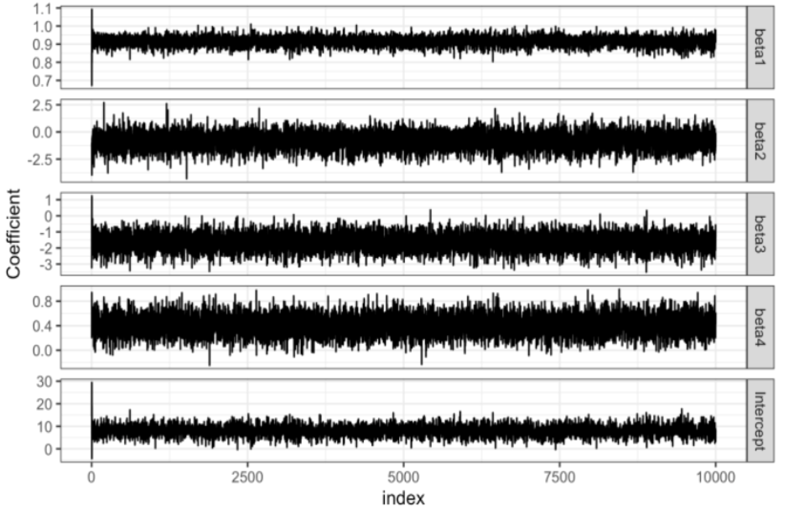
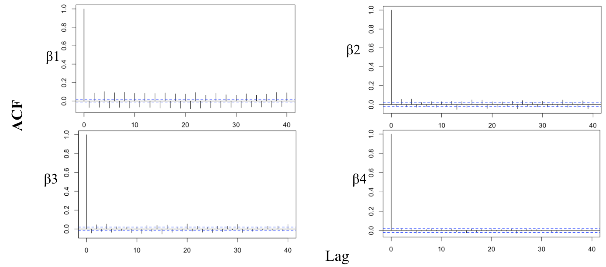
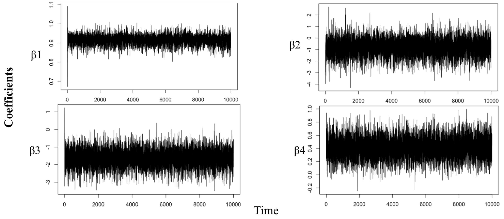

```{r setup, include=FALSE}
knitr::opts_chunk$set(
  message = FALSE,
  warning = FALSE)
```

# Objective

In this project, we firstly built a Bayesian model based on the track data of 703 hurricanes in the North Atlantic area since 1950. A Markov Chain Monte Carlo (MCMC) algorithm was designed to generate the distribution of corresponding parameters. With the start time and type of each hurricane, the estimated coefficients from the Bayesian model were used to explore the seasonal differences and wind speed changes over years. Finally, we explored the characteristics of hurricanes associated with the damage and deaths.


# Background

Hurricanes are large rotating tropical storms with winds in excess of 119 kilometers per hour (74 mph). They usually form between June 1 and November 30 in the Atlantic Ocean but can develop in other oceans as well. They are known as typhoons in the western Pacific and cyclones in the Indian Ocean[1].

When a hurricane approaches land, tremendous damage can occur to the nearby cities. Therefore, scientists continue to improve their ability to forecast hurricanes. The sooner they can access accurate information about a hurricane’s location and intensity, the better the chances to minimize the its impacts. 


# Data Description and Preprocessing

The first data `hurrican703.csv` collected the track data of 703 hurricanes in the North Atlantic area from 1950 to 2013. For all the hurricanes, their locations (longitude \& latitude) and maximum wind speed were recorded every 6 hours. The variables include `ID`, `Season`, `Month`, `Nature`, `time`, `Latitude`, `Longitude`, and `Wind.kt`. Main data processing steps for this data are listed as follows:  
1) Created 3 new variables including the changes of latitude and longitude, as well as the wind speed between the time t and $t-6$;  
2) Removed 9 hurricanes with observations less than 5 to ensure the data partition;  
3) To explore the seasonal differences, we converted the start month for each hurricane into the variable `season`, which includes Spring, Summer, Fall, and Winter. Finally, we have totally **691** hurricanes in the updated dataset.

The second data `hurricanoutcome2.csv` recorded the damages and death caused by 46 hurricanes in the United States, and some features extracted from the above hurricane records. To better explore the characteristics related with death and damage, we combined this data with the coefficients obtained from the first model by the hurricane ID. For this data, we also converted different start months into the corresponding seasons.

## Exploratory Data Analysis

To generally understand the distribution of wind speed across the North Atlantic area, we created the following figure to show the mean maximum wind speed within each knot based on the longitude and latitude from the original data `hurrican703.csv`.

```{r echo = FALSE}
library(tidyverse)
library(maps)
theme_set(theme_bw() + theme(legend.position = "bottom"))

dat <- read_csv("./hurrican703.csv")

# --- plot 1 ---
map <- ggplot(data = dat, aes(x = Longitude, y = Latitude)) + 
  geom_polygon(data = map_data(map = 'world'), 
               aes(x = long, y = lat, group = group))

map +
  stat_summary_2d(data = dat, aes(x = Longitude, y = Latitude, z = dat$Wind.kt), 
                  fun = median, binwidth = c(1, 1), show.legend = TRUE, alpha = .85) + 
  guides(fill = guide_legend(title = "Maximum Wind Speed (in knot)")) +
  ggtitle(paste0("Atlantic Windstorm mean wind speed"))
```


# Statistical Methods
## Likelihood

For each hurricane $i$ and $k_{i}$'s time points, we have the following Bayesian model: $$Y_{i}(t+6)=\beta_{0i}+\beta_{1i} Y_{i}(t)+\beta_{2i} \Delta_{i1}(t)+\beta_{3i} \Delta_{i2}(t)+\beta_{4 i} \Delta_{i 3}(t)+\varepsilon_{i}(t),$$ where $Y_{i}(t)$ is the wind speed at time $t$, $\Delta_{i1}$, $\Delta_{i2}$, and $\Delta_{i3}$ are the changes of latitude, longitude, and the wind speed between time point $t$ and $t - 6$, respectively. $\varepsilon_{i}(t)$ follows a normal distributions with mean zero and variance $\sigma^2$. The above Bayesian model can be simplified as: $$Y_{i}(t+6) = x_{i}(t) + \varepsilon_{i}(t),$$ where $\beta_{i} = (\beta_{0i}, \beta_{1i}, ...,\beta_{4i}) \sim N\left(0, \sigma^2\right).$ Based on the property of the multivariate linear regression model, for each hurricane $i$, we have: $$Y_{i}\mid X_{i} \sim N_{k_{i}}\left(x_{i} \beta_{i}, \sigma^{2} I_{k_{i}}\right),$$ where $I_{k_{i}}$ is an identity matrix with $k_{i}$ dimensions.

Thus, we can consider the following distribution of each hurricane $i$: $$f\left(y_{i} \mid \beta_{i}, \sigma^{2}\right)=\left[(2 \pi)^{k_{i}} \cdot \operatorname{det}\left(\sigma^{2} I_{k_{i}}\right)\right]^{-\frac{1}{2}} \cdot \exp \left\{-\frac{1}{2}\left(y_{i}-x_{i} \beta_{i}\right)^{\top} \left(\sigma^{2} I_{k_{i}}\right)^{-1}\left(y_{i}-x_{i} \beta_{i}\right)\right\}$$.

From above, we derive the following likelihood function:
$$
\begin{aligned}
f\left(y \mid B, \sigma^{2}\right)&=\prod_{i=1}^{n} f\left(y_{i} \mid \beta_{i}, \sigma^{2}\right) \\
&=\prod_{i=1}^{n}\left(\left[(2 \pi)^{k_{i}} \cdot \operatorname{det}\left(\sigma^{2} I_{k i}\right)\right]^{-\frac{1}{2}} \cdot \exp \left\{-\frac{1}{2}\left(y_{i}-x_{i} \beta_{i}\right)^{\top} \left(\sigma^{2} I_{k_{i}}\right)^{-1}\left(y_{i}-x_{i} \beta_{i}\right)\right\}\right)\end{aligned}
$$

## Prior distributions

We assume the following non-informative prior distributions:
$$\beta_{i}=\left(\beta_{0 i}, \beta_{1 i}, \ldots, \beta_{4 i}\right) \sim N_{5}(\mu, \Sigma),$$ where $B=\left(\beta_{1}^{\top}, \beta_{2}^{\top}, \ldots, \beta_{n}^{\top}\right)^{\top}$ and $n$ is the number of hurricanes. So,
$$\pi(B | \mu, \Sigma)=\prod_{i=1}^{n} f\left(\beta_{i}\right) \propto \operatorname{det}(\Sigma)^{-n / 2} \cdot \exp \left\{-\frac{1}{2} \sum_{i}\left[\left(\beta_{i}-\mu\right)^{\top} (\Sigma)^{-1} \left(\beta_{i}-\mu\right)\right]\right\}.$$ Also, $\pi\left(\sigma^{2}\right) \propto \frac{1}{\sigma^{2}}; \hspace{.2cm} \pi(\mu) \propto 1; \hspace{.2cm} \pi\left(\Sigma^{-1}\right) \propto|\Sigma|^{-(d+1)} \cdot \exp \left(-\frac{1}{2} \Sigma^{-1}\right).$

## Conditional posteriors

The posterior distribution is the product of the likelihood and the prior: 

$$g\left(B, \sigma^{2}, \mu, \Sigma^{-1} \mid y\right) \propto f\left(y \mid B, \sigma^{2}\right) \cdot \pi(B \mid \mu, \Sigma^{-1}) \cdot \pi\left(\sigma^{2}\right) \cdot \pi(\mu) \cdot \pi\left(\Sigma^{-1}\right),$$ so we have:

For $\sigma^2$, 
$$
\begin{aligned}
\pi\left(\sigma^{2} \mid \cdot\right) & \propto \prod_{i=1}^{n} \operatorname{det}\left(\sigma^{2} I_{k_{i}}\right)^{-\frac{1}{2}} \cdot \exp \left\{-\frac{1}{2} \Sigma_{i}\left[\left(y_{i}-x_{i} \beta_{i}\right)^{\top}\left(\sigma^{2} I_{k i}\right)^{-1}\left(y_{i}-x_{i} \beta_{i}\right)\right]\right\} \cdot \sigma^{-2} \\
&=\left(\sigma^{2}\right)^{-\frac{1}{2} \Sigma_{i} k_{i}} \cdot \exp \left\{-\frac{1}{2 \sigma^{2}} \Sigma_{i}\left[\left(y_{i}-x_{i} \beta_{i}\right)^{\top} \left(y_{i}-x_{i} \beta_{i}\right)\right]\right\} \cdot \sigma^{-2} \\
&=\left(\sigma^{2}\right)^{-1-\frac{1}{2} \Sigma_{i} k_{i}} \cdot \exp \left\{-\frac{1}{2 \sigma^{2}} \Sigma_{i} \Sigma_{t i}\left(y_{i, t}-x_{i, t} \beta_{i}\right)^{2}\right\}
\end{aligned}
$$
Therefore, $\sigma^2 \sim \text{Inverse Gamma}\left(\frac{1}{2} \Sigma_{i} k_{i}, \frac{1}{2} \Sigma_{i} \Sigma_{t_{i}}\left(y_{i, t}-x_{i, t} \beta_{i}\right)^{2}\right)$.

For $\Sigma$, 
$$
\begin{aligned} 
\pi(\Sigma^{-1} \mid \cdot) & \propto \operatorname{det}(\Sigma)^{-n / 2} \cdot \exp \left\{-\frac{1}{2} \Sigma_{i}\left(\beta_{i}-\mu\right)^{\top} \Sigma^{-1}\left(\beta_{i}-\mu\right)\right\} \cdot \operatorname{det}(\Sigma)^{-(d+1)} \cdot \exp \left\{-\frac{1}{2} \Sigma^{-1}\right\} \\ &=\operatorname{det}(\Sigma)^{-(n/2+d+1)} \cdot \exp \left\{-\frac{1}{2}\left[\Sigma^{-1}+\Sigma_{i}\left(\beta_{i}-\mu\right)^{\top} \Sigma^{-1}\left(\beta_{i}-\mu\right)\right]\right\} \\ 
& \propto \operatorname{det}(\Sigma^{-1})^{(n+2 d+2) / 2} \cdot \exp \left\{-\frac{1}{2} \operatorname{tr}\left[\Sigma^{-1}\cdot\left(I+\Sigma_{i}\left(\beta_{i}-\mu\right)\left(\beta_{i}-\mu\right)^{\top}\right]\right\}\right.\\ 
& \propto \operatorname{det}(\Sigma^{-1})^{(n+3d+3-d-1) / 2} \cdot \exp \left\{-\frac{1}{2} \operatorname{tr}\left[\Sigma^{-1} \cdot\left(I+\Sigma_{i}\left(\beta_{i}-\mu\right)\left(\beta_{i}-\mu\right)^{\top}\right]\right\}\right.
\end{aligned}
$$
Thus $\Sigma^{-1} \sim \text {Wishart}\left(n + 3d+3,[I+\Sigma_{i}\left(\beta_{i}-\mu\right)\left(\beta_{i}-\mu\right)^{\top}\right]^{-1})$, that is: $$\Sigma \sim \text {Inverse Wishart}\left(n + 3d+3,I+\Sigma_{i}\left(\beta_{i}-\mu\right)\left(\beta_{i}-\mu\right)^{\top}\right)$$

For $\mu$,
$$
\begin{aligned}
\pi(\mu \mid \cdot) & \propto \exp \left\{-\frac{1}{2} \Sigma_{i}\left[\left(\beta_{i}-\mu\right)^{\top} \Sigma^{-1}\left(\beta_{i}-\mu\right)\right]\right\} \\
&=\exp \left\{-\frac{1}{2} \Sigma_{i}\left(\beta_{i}^{\top} \Sigma^{-1} \beta_{i}+\mu^{\top} \Sigma^{-1} \mu-2 \beta_{i}^{\top} \Sigma^{-1} \mu\right)\right\} \\
&=\exp \left\{-\frac{1}{2}\left(\Sigma_{i} \beta_{i}^{\top} \Sigma^{-1} \beta_{i}+\mu^{\top} n \Sigma^{-1} \mu-2 \Sigma_{i} \beta_{i}^{\top} \Sigma^{-1} \mu\right)\right\} \\
&=\exp \left\{-\frac{1}{2}\left(\mu^{\top} n \Sigma^{-1} \mu-2 \Sigma_{i} \beta_{i}^{\top} \Sigma^{-1} \mu+\Sigma_{i}\beta_{i}^{\top} \Sigma^{-1} \beta_{i}\right)\right\} \\
&=\exp \left\{-\frac{1}{2}(\mu^{\top} \underbrace{n\Sigma^{-1}}_{M}  \mu-2 \mu^{\top} \underbrace{\Sigma_{i} \Sigma^{-1} \beta_{i}}_{N}+\Sigma_{i} \beta_{i}^{\top} \Sigma^{-1} \beta_{i})\right\} \\
&=\exp \left\{-\frac{1}{2}\left[\left(\mu-M^{-1} N\right)^{\top} M\left(\mu-M^{-1} N\right)\right]\right\}.
\end{aligned}
$$
Therefore, $\mu \sim MVN\left(M^{-1} N, {M}^{-1}\right)$.

And for $B$,
$$
\begin{aligned}
&\pi(B \mid \cdot) \propto \exp \left\{-\frac{1}{2} \Sigma_{i}\left[\left(y_{i}-x_{i} \beta_{i}\right)^{\top}\left(\sigma^{2} I_{k i}\right)^{-1}\left(y_{i}-x_{i} \beta_{i}\right)\right]\right\} \cdot \exp \left\{-\frac{1}{2} \Sigma_{i}\left[\left(\beta_{i}-\mu\right)^{\top} (\Sigma)^{-1} \left(\beta_{i}-\mu\right)\right]\right\} \\
&=\exp \left\{-\frac{1}{2} \Sigma_{i}\left[\left(y_{i}-x_{i} \beta_{i}\right)^{\top}\left(\sigma^{2} I_{k i}\right)^{-1}\left(y_{i}-x_{i} \beta_{i}\right)+\left(\beta_{i}-\mu\right)^{\top} \Sigma^{-1}\left(\beta_{i}-\mu\right)\right]\right\} \\
&=\exp \left\{ -\frac{1}{2} \Sigma_{i}[ y_{i}^{\top} \sigma^{-2} I_{k i} y_{i}+\beta_{i}^{\top} x_{i}^{\top} \sigma^{-2} I_{k_{i}} x_{i} \beta_{i}-2 y_{i}^{\top} \sigma^{-2} I_{k i} x_{i} \beta_{i}+\beta_{i}^{\top} \Sigma^{-1} \beta_{i}+\mu^{\top} \Sigma^{-1} \mu-2 \mu^{\top} \Sigma^{-1} \beta_{i}] \right\} \\
&=\exp \left\{-\frac{1}{2} \Sigma_{i}[y_{i}^{\top} \sigma^{-2} I_{k i} y_{i}+\mu^{\top} {\Sigma}^{-1} \mu+\beta_{i}^{\top}\left({\Sigma}^{-1}+x_{i}^{\top} {\sigma}^{-2} I_{k i} x_{i}\right) \beta_{i}-2\left(y_{i}^{\top} \sigma^{-2} I_{k i} x_{i}+\mu^{\top} \Sigma^{-1}\right) \beta_{i}] \right\}
\end{aligned}
$$


We can define the following terms:
$$R=y_{i}^{\top} \sigma^{-2} I_{k_{i}} y_{i}+\mu^{\top} \Sigma^{-1} \mu$$
$$V=\Sigma^{-1}+x_{i}^{\top} \sigma^{-2} I_{k i} x_{i}$$
$$M=\sigma^{-2} x_{i}^{\top} y_{i}+\Sigma^{-1} \mu$$

Thus, 
$\pi (B \mid \cdot) \propto \left(\beta_{i} -V^{-1} M\right)^{\top} V\left(\beta_{i}-V^{-1} M\right) \sim MVN\left(V^{-1} M, {V}^{-1}\right)$


## Gibbs Sampling
Since directly generating the above parameters from the jointly density is rather complicated, we implement the gibbs sampler to sample each variable in turn. Based on the previous conditional distributions, we updated the four parameters including $B$, $\sigma^2$, $\Sigma$, and $\mu$ in sequence. Finally, we determined 10,000 iterations. Note that we ignored the first 8,000 iterations so that the stationary distribution of the Markov chain was reached.

## Regression Models

To explore the seasonal and annual difference in the wind speed, we took the $\beta$ coefficients obtained from the Bayesian model as the response and built the following linear regression model:
$$\beta_{j} \sim Season + Year + Nature, j = 0,..., 4,$$ where season and nature are categorical variables, and year is continuous. 

To further predict the hurricane-induced damage, we incorporated the coefficients from the Bayesian model and the new predictors in the second data, selected some features by lasso, and finally fit a regression model. The variables $\beta_{0}$, Year, max speed, total affected population, and the affected population reside in the United States were selected in the model. That is, $$Damage \sim \beta_{0} + Year + Maxspeed + Total.Pop + Percent.USA$$

Then we also select some variables by lasso and built the following poisson regression model to evaluate the characteristics related to deaths.
$$
\begin{aligned}
Death \sim \beta_{4} + MonthSummer + Maxspeed + Maxpressure \\
+ Meanpressure + Hours + Total.Pop + Percent.Poor,
\end{aligned}
$$
where the above $\beta_{0}$ and $\beta_{4}$ are the coefficients from the Bayesian model.

# Results
## MCMC-Gibbs Sampling
The initial values for $\mu$, $\sigma^{2}$ and $\Sigma$ we set are (50,0,0,0,0), 0.5 and `diag(0.5, 5, 5)` respectively. In the case of Gibbs results, we set 10000 iterations and record the $\beta_{i,j}^n$ in each iteration with a linear model (from the least square method) to demonstrate how similar the coefficients are for each hurricane’s train data and $\mu^n$.

To minimize the variance generated randomly by Gibbs sampling and avoid the non convergent situation at the beginning of the iteration, we only take the coefficients value from 8000 to 10000 times where we take the mean value for each coefficients $\beta_{i,j}$ as the final results. To evaluate how well the estimated Bayesian model tracks the individual hurricanes, we divided the observations within each hurricane ID by 8:2 randomly to create a training and testing set. Then we calculated RMSE for each different hurricane.

For our final results obtained from Gibbs sampling, you could jump to our [$\textcolor{blue}{github}$](https://github.com/hw2849/p8160_group_project_3/blob/master/res_1_4th_edition.csv)(Column2: RMSE for the test dataset, Column3-7: Mean coefficients $\beta_{i,j}$ for each hurricane by Gibbs sampling, Column8-12: coefficients $\beta_{i,j}$ for each hurricane by lm() function, Column13-17: Mean $\mu$ for $B$) 

In order to further elucidate the results from our Gibbs methods, we take `ABLE.1950` as an example. Firstly, we trace the Gibbs step for only extracting the $\beta_{1,j}^n$ from $B^n$ by plotting the value. 

<center>
{}
</center>

Then to look deeply into how the coefficients change with the increasing of iteration times, we also plot the autocorrelation plot(ACF) and time series plot (TS) where we could tell that the correlation for coefficient values between zero and blue line are not statistically significant. 

<center>
{}
</center>
<center>
{}
</center>

For the case of `ABLE.1950`, the RMSE for the remaining 20% test dataset is 4.25 and the comparison of  coefficients $\beta_{1,j}$ is in the table below.

```{r, echo = FALSE, message=FALSE, warning=FALSE}
 library(tidyverse)
 df = tibble(
   model = c("Gibbs sampling", "Linear(lm)"),
   Intercept = c(7.601, 8.833),
   Beta1 = c(0.919, 0.912),
   Beta2 = c(-0.788, -1.394),
   Beta3 = c(-1.644, -2.013),
   Beta4 = c(0.411, 2.983)
 )
 knitr::kable(df, caption = "Compare the Coefficients from Gibbs Sampling and lm function")
```

## Seasonal and Annual Difference

There are three significant variables in the regression model for $\beta_{1}$, which represent current wind speed. Season spring and summer, year all have negative coefficients, indicating wind speed tend to decrease in spring and summer. There is no evidence of increasing trend in $\beta_{1}$ with the increase in year. 

$$
\begin{aligned}
&\text { Table 2: Beta } 1 \text { Coefficients }\\
&\begin{array}{lrrrr}
\hline & \text { Estimate } & \text { Std. Error } & \text { t value } & \operatorname{Pr}(>|\mathrm{t}|) \\
\hline \text { (Intercept) } & 2.3394 & 0.3366 & 6.9498 & 0.0000 \\
\text { seasonSpring } & -0.0636 & 0.0195 & -3.2599 & 0.0012 \\
\text { seasonSummer } & -0.0161 & 0.0062 & -2.6198 & 0.0090 \\
\text { seasonWinter } & -0.0476 & 0.0303 & -1.5721 & 0.1164 \\
\text { year } & -0.0008 & 0.0002 & -4.4804 & 0.0000 \\
\text { natureET } & 0.0247 & 0.0233 & 1.0597 & 0.2897 \\
\text { natureNR } & -0.0174 & 0.0367 & -0.4743 & 0.6355 \\
\text { natureSS } & 0.0027 & 0.0160 & 0.1703 & 0.8648 \\
\text { natureTS } & -0.0086 & 0.0125 & -0.6900 & 0.4904 \\
\hline
\end{array}
\end{aligned}
$$

There are no significant variables in the regression model for $\beta_{2}$ and $\beta_{3}$.
Season spring is the only significant variable in the regression model for $\beta_{4}$, indicating seasonal difference in acceleration of wind speed. 

$$
\begin{aligned}
&\text { Table 3: Beta } 4 \text { Coefficients }\\
&\begin{array}{lrrrr}
\hline & \text { Estimate } & \text { Std. Error } & \text { t value } & \operatorname{Pr}(>|\mathrm{t}|) \\
\hline \text { (Intercept) } & 2.3357 & 1.3705 & 1.7043 & 0.0888 \\
\text { seasonSpring } & -0.2316 & 0.0794 & -2.9177 & 0.0036 \\
\text { seasonSummer } & -0.0024 & 0.0251 & -0.0938 & 0.9253 \\
\text { seasonWinter } & -0.0587 & 0.1233 & -0.4758 & 0.6343 \\
\text { year } & -0.0009 & 0.0007 & -1.3816 & 0.1676 \\
\text { natureET } & -0.0984 & 0.0947 & -1.0391 & 0.2991 \\
\text { natureNR } & -0.1024 & 0.1495 & -0.6846 & 0.4938 \\
\text { natureSS } & -0.0971 & 0.0650 & -1.4927 & 0.1360 \\
\text { natureTS } & -0.0365 & 0.0509 & -0.7176 & 0.4733 \\
\hline
\end{array}
\end{aligned}
$$

## Hurricane-induced damage and deaths prediction

After variable selection by lasso regression, the linear regression model for hurricane-induced damage has positive coefficients for Year, $\beta_{0}$, Maxspeed, Total.Pop, and Percent.USA, indicating positive correlation between these hurricane characteristics and damage. Among these, year is the only significant variable.

$$
\text{Table 4: Coefficients of regression model for Damage}\\
\begin{array}{lrrrr} 
& \text { Estimate } & \text { Std. Error} &{t value} & \operatorname{Pr}(>|t|) \\
\hline
\text { (Intercept) } & 11.155 & 3.067 & 3.638 & 0.000833 \\
\text { Year } & 7.918 & 3.229 & 2.452 & 0.019035 \\
\text { beta0}  & 3.728 & 3.158 & 1.181 & 0.245323 \\
\text { Maxspeed } & 4.787 & 3.257 & 1.470 & 0.150046 \\
\text { Total.Pop } & 2.128 & 3.240 & 0.657 & 0.515240 \\
\text { Percent. USA } & 5.913 & 3.205 & 1.845 & 0.073077 \\
\hline
\end{array}
$$

The variables selected by lasso regression for hurricane-induced deaths include Summer, $\beta_{4}$, Maxspeed, Maxpressure, Hours, Total.Pop, and Percent Poor.  All the selected variables shows significance in the poisson regression model. $\beta_{4}$, hours, and Percent.Poor has positive correlation with deaths while the other variables have negative coefficients. 

$$
\text{Table 5: Coefficients of regression model for Deaths}\\
\begin{array}{lrrrr} 
& \text { Estimate } & \text { Std. Error } & \text { value } & \operatorname{Pr}(>|z|) \\
\hline
\text { (Intercept) } & 5.539 \mathrm{e}+01 & 2.775 \mathrm{e}+00 & 19.958 & <2 \mathrm{e}-16 \\
\text { MonthSummer } & -1.097 \mathrm{e}+00 & 2.250 \mathrm{e}-02 & -48.747 & <2 \mathrm{e}-16 \\
\text { beta4} & 3.641 \mathrm{e}+00 & 6.543 \mathrm{e}-02 & 55.645 & <2 \mathrm{e}-16 \\
\text { Maxspeed } & -8.392 \mathrm{e}-04 & 4.104 \mathrm{e}-04 & -2.045 & 0.0409 \\
\text { Maxpressure } & -5.160 \mathrm{e}-02 & 2.738 \mathrm{e}-03 & -18.850 & <2 \mathrm{e}-16 \\
\text { Hours } & 1.903 \mathrm{e}-03 & 9.169 \mathrm{e}-05 & 20.754 & <2 \mathrm{e}-16 \\
\text { Total.Pop } & -8.973 \mathrm{e}-08 & 1.371 \mathrm{e}-08 & -6.547 & 5.87 \mathrm{e}-11 \\
\text { Percent.Poor } & 3.452 \mathrm{e}-02 & 1.514 \mathrm{e}-04 & 227.951 & <2 \mathrm{e}-16 \\
\hline
\end{array}
$$

# Discussion and Limitations


# Contributions
We contributed to this project evenly.


# Reference
[1] https://www.whoi.edu/know-your-ocean/ocean-topics/ocean-human-lives/natural-disasters/hurricanes/?gclid=Cj0KCQjwsdiTBhD5ARIsAIpW8CIO0bvwlo16Pisxe_WV7owA4KdbMfpAhMxqa-z8Ir3fsQyfiHPa2MAaAlmZEALw_wcB  


# Appendix
For codes please click [$\textcolor{blue}{here}$](https://github.com/hw2849/p8160_group_project_3.git)